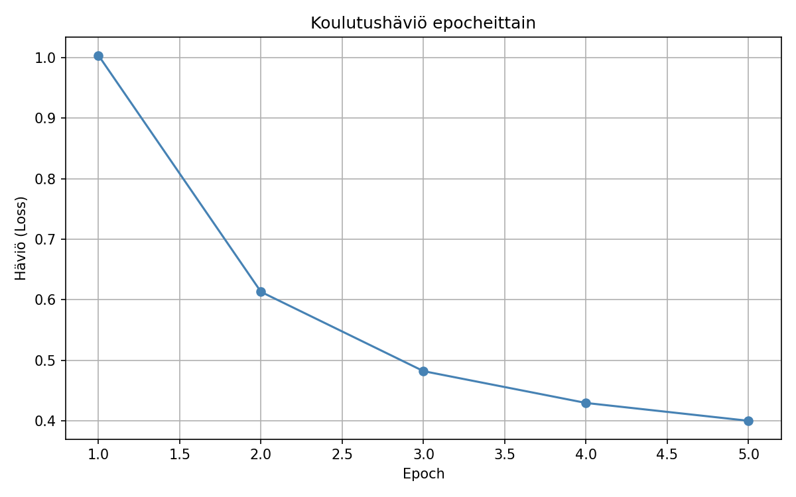
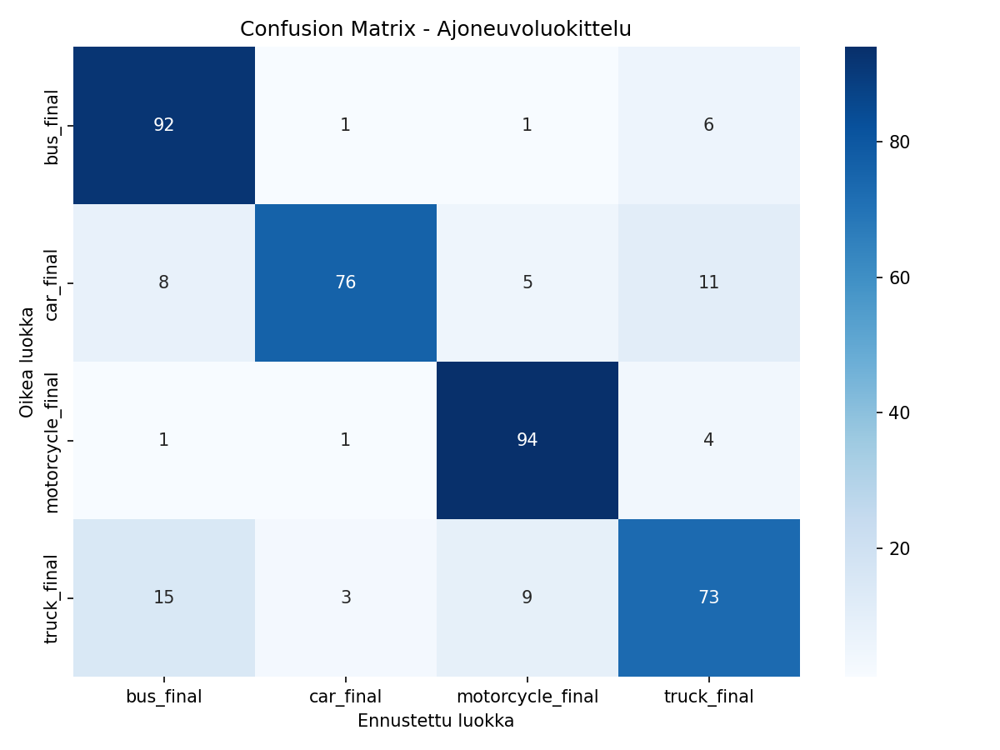
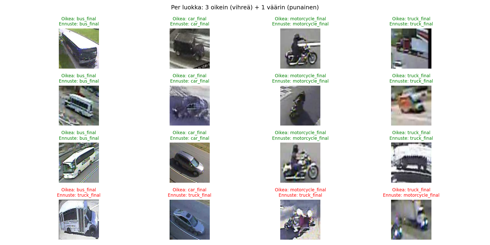

# Vehicle Classifier — Functional Thesis Project

This project was developed part of a functional bachelor's thesis. The goal of this project is to build an image classifier that categorizes vehicles into four categories using transfer learning.

The implementation is written in Python using **PyTorch**, using pre-trained **ResNet-18** neural network.

##  Project Overview
- **Objective:** Classify vehicle images into 4 categories (`bus`, `car`, `motorcycle`, `truck`).
- **Framework:** PyTorch & Torchvision
- **Architecture:** ResNet-18 (Pre-trained weights)
- **Methodology:** Transfer learning (Freezing all layers except last).
- **Optimization:** Adam Optimizer with Cross-Entropy Loss.
- **Visualisation:** MatplotLib

---

##   Visualisation preview






##   Structure

Below is the layout of the project, including the balanced dataset used for training and validation:

```text
vehicle_classifier/
├── data/
│   ├── train/                  # Training data
│   │   ├── bus_final/          # 568 images
│   │   ├── car_final/          # 568 images
│   │   ├── motorcycle_final/   # 568 images
│   │   └── truck_final/        # 568 images
│   └── val/                    # Validation data
│       ├── bus_val/            # 100 images
│       ├── car_val/            # 100 images
│       ├── motorcycle_val/     # 100 images
│       └── truck_val/          # 100 images
├── demo.py                     # Main training, evaluation, and visual script
├── image_mover.py              # Utility script for dataset organization/preprocessing
├── vehicle_model.pth           # Saved model weights (generated after training)
├── training_loss.png           # Exported loss visualization
├── confusion_matrix.png        # Exported classification performance matrix
└── predictions.png             # Visualized sample predictions from validation set
